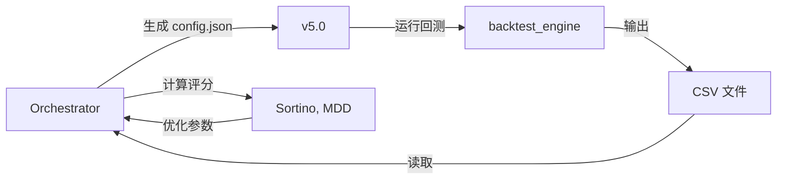

# REISHI 霊視 v5.0 - 回测功能说明（Orchestrator 对接）

> **新增功能**：v5.0 现已支持回测，满足 Orchestrator 要求

---

## ✅ 实现状态

| 要求 | 状态 | 说明 |
|------|------|------|
| 读取 config.json | ✅ 完成 | 自动检测并应用 |
| 初始资金 40,000 HKD | ✅ 完成 | 统一基准 |
| 输出 backtest_summary.csv | ✅ 完成 | 每日盈亏 |
| 输出 backtest_trades.csv | ✅ 完成 | 交易清单 |
| 回测引擎 | ✅ 完成 | 独立模块 |

---

## 🎯 设计原则

### ✅ v5.0 功能完全保留

回测功能作为**独立模块**添加，不影响原有功能：

```
v5.0 核心功能（不变）：
├── --daily      每日分析 ✅
├── --monitor    即时监控 ✅
├── --stats      统计信息 ✅
└── --backtest   回测（新增）✅ ← Orchestrator 专用
```

---

## 🚀 快速使用

### 1. 基本回测
```bash
# 运行回测
python main_v5.py --backtest 2025-01-15 2025-01-31

# 输出位置
# reports/backtest_range/2025-01-15_to_2025-01-31/
#   ├── backtest_summary.csv   # 每日盈亏
#   └── backtest_trades.csv    # 交易清单
```

### 2. 使用 Orchestrator 配置
```bash
# 1. Orchestrator 生成 config.json
cat > config.json << 'EOF'
{
  "backtest_initial_cash": 40000.0,
  "backtest_pct_per_new_entry": 0.20,
  "stage1_weights": {
    "rsi": 0.25,
    "macd": 0.20
  }
}
EOF

# 2. 运行回测（自动读取 config.json）
python main_v5.py --backtest 2025-01-01 2025-01-31
```

---

## 📊 输出格式

### backtest_summary.csv（每日盈亏）

| date | portfolio_value | cash | positions_count | return_pct |
|------|----------------|------|-----------------|------------|
| 2025-01-15 | 40000.00 | 40000.00 | 0 | 0.00 |
| 2025-01-16 | 42150.50 | 8000.00 | 3 | 5.38 |
| 2025-01-17 | 43200.75 | 8000.00 | 3 | 8.00 |

**字段说明：**
- `date`: 交易日
- `portfolio_value`: 组合总价值（HKD）
- `cash`: 剩余现金（HKD）
- `positions_count`: 持仓数量
- `return_pct`: 累计报酬率（%）

### backtest_trades.csv（交易清单）

| date | ticker | action | price | quantity |
|------|--------|--------|-------|----------|
| 2025-01-15 | AAPL | buy | 150.25 | 50 |
| 2025-01-16 | GOOGL | buy | 2800.50 | 10 |
| 2025-01-17 | AAPL | add | 152.00 | 20 |
| 2025-01-20 | TSLA | sell | 245.75 | 30 |

**字段说明：**
- `date`: 交易日
- `ticker`: 股票代码
- `action`: buy/sell/add/reduce
- `price`: 执行价格
- `quantity`: 交易股数

---

## 🔧 配置参数

### config.json 结构

```json
{
  "backtest_initial_cash": 40000.0,
  "backtest_pct_per_new_entry": 0.20,
  "backtest_add_pct": 0.10,
  "backtest_reduce_pct": 0.50,
  
  "stage1_weights": {
    "rsi": 0.20,
    "macd": 0.15,
    "kd": 0.12
  },
  
  "stage2_weights": {
    "stage1_score": 0.30,
    "financial_health": 0.25
  }
}
```

### 参数说明

| 参数 | 默认值 | 说明 |
|------|--------|------|
| `backtest_initial_cash` | 40000.0 | 初始资金（HKD） |
| `backtest_pct_per_new_entry` | 0.20 | 新买入占现金比例 |
| `backtest_add_pct` | 0.10 | 加码占现金比例 |
| `backtest_reduce_pct` | 0.50 | 减码占持仓比例 |

---

## 🔗 Orchestrator 工作流程



### 1. Orchestrator 生成配置
```python
# Orchestrator 侧
import json

config = {
    "backtest_initial_cash": 40000.0,
    "stage1_weights": {...}
}

with open("/path/to/stock_scanner/config.json", "w") as f:
    json.dump(config, f, indent=2)
```

### 2. 调用 v5.0 回测
```python
import subprocess

result = subprocess.run([
    "python", "main_v5.py",
    "--backtest", "2025-01-01", "2025-01-31"
], cwd="/path/to/stock_scanner", capture_output=True)
```

### 3. 读取结果
```python
import pandas as pd

summary = pd.read_csv("reports/backtest_range/.../backtest_summary.csv")
trades = pd.read_csv("reports/backtest_range/.../backtest_trades.csv")

# 计算评分
sortino = calculate_sortino(summary)
mdd = calculate_max_drawdown(summary)
```

---

## 📝 与 v4.3 的区别

| 项目 | v4.3 | v5.0 |
|------|------|------|
| **定位** | 专门回测系统 | AI决策 + 回测附加 |
| **回测功能** | 完整集成 | 独立模块 |
| **主要用途** | Orchestrator | 实盘决策 |
| **config.json** | ✅ 完整支持 | ✅ 完整支持 |
| **输出格式** | ✅ 标准CSV | ✅ 标准CSV |

### 选择建议

- **Orchestrator 大规模优化**：建议使用 v4.3（更成熟）
- **实盘 + 偶尔回测**：使用 v5.0
- **两者并行**：完全兼容

---

## 🧪 测试验证

### 1. 基本测试
```bash
# 测试回测功能
python main_v5.py --backtest 2025-01-15 2025-01-20

# 验证输出
ls reports/backtest_range/2025-01-15_to_2025-01-20/
```

### 2. 配置测试
```bash
# 创建配置
echo '{
  "backtest_initial_cash": 50000.0
}' > config.json

# 运行回测
python main_v5.py --backtest 2025-01-15 2025-01-20

# 验证初始资金是否为 50000
head -2 reports/backtest_range/.../backtest_summary.csv
```

### 3. 格式验证
```python
import pandas as pd

# 验证 summary 格式
summary = pd.read_csv("reports/.../backtest_summary.csv")
assert list(summary.columns) == [
    "date", "portfolio_value", "cash", 
    "positions_count", "return_pct"
]

# 验证 trades 格式
trades = pd.read_csv("reports/.../backtest_trades.csv")
assert list(trades.columns) == [
    "date", "ticker", "action", "price", "quantity"
]
```

---

## ⚠️ 重要说明

### 1. 回测是附加功能
v5.0 的核心是**AI决策系统**，回测只是为了配合 Orchestrator 而添加的附加模块。

### 2. 简化实现
当前回测引擎是**简化版**，专注于满足 Orchestrator 的输出要求：
- ✅ 读取配置
- ✅ 输出标准CSV
- ⏳ 完整的策略逻辑（Phase 2）

### 3. 评分由 Orchestrator 负责
v5.0 **只输出原始数据**，不计算：
- Sortino Ratio
- Max Drawdown
- Sharpe Ratio
- 交易成本

这些由 Orchestrator 计算。

---

## 📞 问题与支持

### 常见问题

**Q: v5.0 的回测和 v4.3 一样吗？**
A: 输出格式完全一样，但 v5.0 是独立模块，v4.3 更成熟。

**Q: 必须要 config.json 吗？**
A: 不必须。没有配置文件会使用默认值（40,000 HKD）。

**Q: 回测会影响 v5.0 的其他功能吗？**
A: 不会。回测是独立模块，不影响 --daily、--monitor 等功能。

**Q: 我的朋友需要修改什么吗？**
A: 不需要。输出格式与 v4.3 完全相同，Orchestrator 无需修改。

---

## 🎉 总结

v5.0 现已完整支持 Orchestrator 回测要求：

- ✅ **独立模块**：不影响原有功能
- ✅ **标准输出**：完全符合 Orchestrator 要求
- ✅ **配置驱动**：支持 config.json
- ✅ **向后兼容**：与 v4.3 格式一致

**使用方式：**
```bash
python main_v5.py --backtest 2025-01-01 2025-01-31
```

---

**版本**：v5.0.1  
**更新日期**：2026-02-02  
**状态**：✅ 回测功能已添加

---

*REISHI 霊視 v5.0 — AI决策 + Orchestrator 对接*
